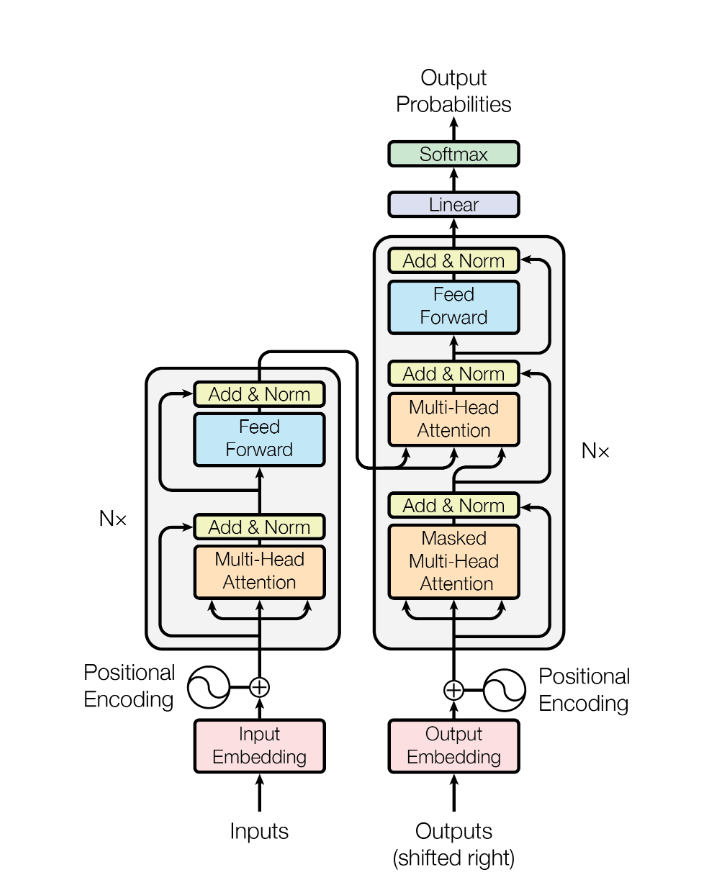
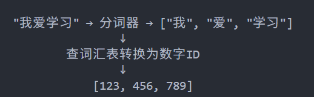
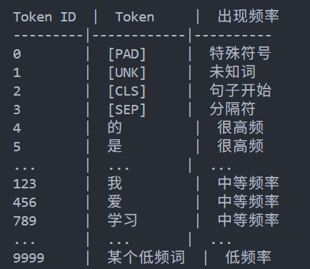

# Transformer 架构

<div align="center">
  
  <p>图1: Transformer模型的整体架构图</p>
</div>

## Input Embedding
Transformer 的 Input Embedding 主要包含词嵌入和位置编码部分。

### Token Embedding（词嵌入）
词嵌入的过程，就是将一个个词转换为形如 $512 \times 1$ 的向量。具体来说，首先可以把输入的句子视作一个字符串，经过分词器处理后，句子会被切分成一个个词，其中标点符号也会被单独视为一个词，这些词统称为`Token`。
接着，每个`Token`会通过词汇表映射到对应的`Token ID`




词汇表是根据分词器训练出来的一个 Token 到 Token ID 的映射结构



假设词汇表是有 10000 个词，那么嵌入矩阵（embedding_matrix）则是$10000 \times 512$的，这样，就能确保每个`Token ID`单独对应一个词嵌入矩阵中的一行，即一个$512 \times 1$ 的向量。
```
  embedding_matrix = [
      [0.1, 0.2, -0.3, ..., 0.5],  # 第0行：ID=0的向量
      [0.4, -0.1, 0.7, ..., 0.2],  # 第1行：ID=1的向量
      ...
      [0.3, 0.8, -0.2, ..., 0.1],  # 第123行：ID=123("我")的向量
      ...
      [0.7, -0.4, 0.9, ..., 0.3],  # 第456行：ID=456("爱")的向量
      ...
      [-0.2, 0.6, 0.1, ..., 0.8],  # 第789行：ID=789("学习")的向量
      ...
  ]
```
嵌入矩阵的参数最初是一些随机数，那他的每一行，为什么能代表一个具体的词呢？这是因为词嵌入矩阵也跟随模型一起训练，一开始的随机数确实不能代表任何语义，但通过一轮轮的训练之后，这些向量就能在这个模型中代表特定的词了
### Positiional Encoding（位置编码）

## Mutil-Head Attention


## Add & Norm

## 